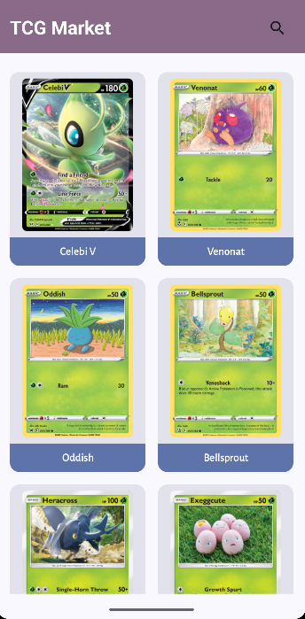
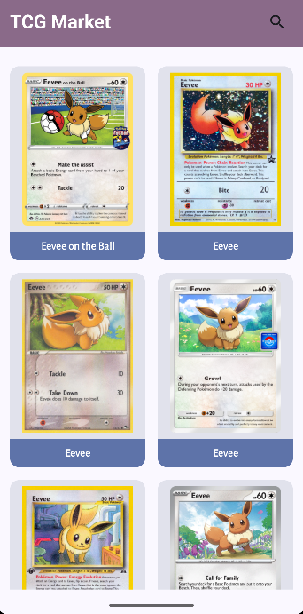
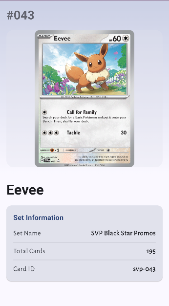
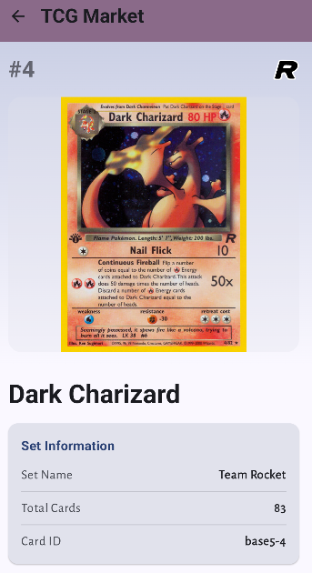
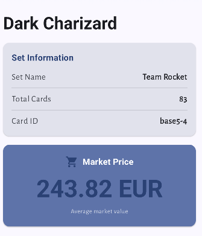

# 🎴 PokeTCGApp - Aplicación de Cartas Pokémon TCG

<div align="center">
  
  
  [](https://developer.android.com/)
  [](https://kotlinlang.org/)
  [](https://developer.android.com/jetpack/compose)
  [](https://developer.android.com/topic/architecture)
</div>

## 📱 Descripción del Proyecto

**PokeTCGApp** es una aplicación Android moderna desarrollada con **Jetpack Compose** que permite a los usuarios explorar y buscar cartas del Trading Card Game (TCG) de Pokémon. La aplicación implementa una arquitectura **MVVM** robusta con paginación eficiente, gestión de imágenes optimizada y una experiencia de usuario fluida.

### 🎯 Características Principales

- **🚀 Splash Screen**: Pantalla de inicio con animación personalizada
- **🔍 Búsqueda Inteligente**: Sistema de búsqueda en tiempo real con debounce
- **📄 Paginación Eficiente**: Carga progresiva de cartas para optimizar rendimiento
- **🖼️ Gestión de Imágenes**: Carga y cache de imágenes con Coil
- **🧭 Navegación Fluida**: Navegación entre pantallas con Navigation Compose
- **🏗️ Arquitectura Sólida**: Implementación MVVM con inyección de dependencias
- **🧪 Testing**: Tests unitarios e instrumentados para funcionalidades críticas

## 🏛️ Arquitectura del Proyecto

### Patrón MVVM (Model-View-ViewModel)

La aplicación sigue estrictamente el patrón **MVVM** para garantizar una separación clara de responsabilidades:

```
📁 presentation/
├── 📁 cardlist/
│   ├── CardListViewModel.kt      # ViewModel para lista de cartas
│   ├── CardDetailViewModel.kt    # ViewModel para detalles de carta
│   ├── 📁 screens/               # Pantallas (Views)
│   │   ├── CardListScreen.kt
│   │   └── CardDetailScreen.kt
│   └── 📁 components/            # Componentes reutilizables
│       ├── AppTopBar.kt
│       ├── CardCollectionGrid.kt
│       ├── CardHeaderSection.kt
│       ├── CardInfoSection.kt
│       ├── CardItem.kt
│       ├── InfoRow.kt
│       ├── PriceSection.kt
│       └── SearchBarCards.kt
└── 📁 model/                     # Modelos de presentación
    ├── CardModel.kt
    └── CardDetailModel.kt

📁 data/
├── CardRepository.kt             # Repositorio (Model)
├── CardPagingSource.kt          # Fuente de paginación
├── 📁 response/                  # Data classes de respuesta API
│   ├── CardResponse.kt
│   └── CardInfoDetailResponse.kt
└── 📁 service/                   # Servicios de red
    └── CardTCGApiService.kt
```

### 🔄 Flujo de Datos

1. **View** (Compose UI) → **ViewModel** (Lógica de presentación)
2. **ViewModel** → **Repository** (Acceso a datos)
3. **Repository** → **API Service** (Red) / **PagingSource** (Paginación)
4. **API Response** → **Model** (Mapeo de datos)
5. **Model** → **ViewModel** → **View** (Actualización de UI)

### 📁 Separación de Responsabilidades

#### **Data Layer (`/data/`)**
- **`response/`**: Data classes que representan la estructura exacta de la respuesta de la API
  - `CardResponse.kt` - Respuesta de lista de cartas
  - `CardInfoDetailResponse.kt` - Respuesta de detalles de carta
- **`service/`**: Interfaces y servicios de red
  - `CardTCGApiService.kt` - Definición de endpoints de la API
- **`CardRepository.kt`**: Repositorio que coordina el acceso a datos
- **`CardPagingSource.kt`**: Implementación de paginación personalizada

#### **Presentation Layer (`/presentation/`)**
- **`model/`**: Modelos de dominio que se muestran en la UI
  - `CardModel.kt` - Modelo simplificado para lista de cartas
  - `CardDetailModel.kt` - Modelo completo para detalles de carta
- **`cardlist/screens/`**: Pantallas principales de la aplicación
- **`cardlist/components/`**: Componentes reutilizables de UI
- **`cardlist/`**: ViewModels que manejan la lógica de presentación

## 🚀 Tecnologías y Librerías

### Core Android
- **Android SDK 24+** - Soporte para dispositivos modernos
- **Kotlin 2.2.20** - Lenguaje de programación principal
- **Jetpack Compose** - UI declarativa moderna
- **Material Design 3** - Sistema de diseño consistente
- **Core SplashScreen 1.0.1** - Splash screen moderno con animaciones

### Arquitectura y Patrones
- **MVVM** - Patrón arquitectónico principal
- **Repository Pattern** - Abstracción de acceso a datos
- **Dagger Hilt 2.57.1** - Inyección de dependencias
- **StateFlow/Flow** - Gestión de estado reactiva

### Red y Datos
- **Retrofit 3.0.0** - Cliente HTTP para APIs REST
- **Gson** - Serialización/deserialización JSON
- **Paging 3.3.6** - Paginación eficiente de datos
- **Coil 2.7.0** - Carga y cache de imágenes

### Testing
- **JUnit 4** - Framework de testing unitario
- **AndroidJUnit4** - Testing instrumentado
- **Compose Testing** - Testing de UI con Compose

## 📊 Implementación de Paginación

### Estrategia de Paginación

La aplicación implementa **paginación eficiente** para manejar grandes volúmenes de datos:

```kotlin
// Configuración de paginación en CardRepository
fun getAllCards(): Flow<PagingData<CardModel>> {
    return Pager(
        config = PagingConfig(
            pageSize = MAX_ITEMS,        // 20 elementos por página
            prefetchDistance = PREFETCH_ITEMS  // Precarga 4 elementos
        ),
        pagingSourceFactory = {
            CardPagingSource(api, "")
        }
    ).flow
}
```

### Características de la Paginación

- **📄 Tamaño de Página**: 20 cartas por carga
- **⚡ Precarga**: 4 elementos de anticipación
- **🔄 Refresh**: Actualización automática de datos
- **🔍 Búsqueda Paginada**: Búsqueda con paginación independiente
- **💾 Cache**: Almacenamiento en memoria con `cachedIn()`

## 🌐 Integración con APIs

### Retrofit + TCG Dex API

```kotlin
@Module
@InstallIn(SingletonComponent::class)
object NetworkModule {
    private const val BASE_URL = "https://api.tcgdx.net/"
    
    @Provides
    fun provideRetrofit(okHttpClient: OkHttpClient): Retrofit =
        Retrofit.Builder()
            .baseUrl(BASE_URL)
            .addConverterFactory(GsonConverterFactory.create())
            .client(okHttpClient)
            .build()
}
```

### Endpoints Implementados

- `GET /v2/en/cards` - Lista paginada de cartas
- `GET /v2/en/cards?name={query}` - Búsqueda por nombre
- `GET /v2/en/cards/{id}` - Detalles de carta específica

## 🖼️ Gestión de Imágenes con Coil

### Configuración Optimizada

```kotlin
// En CardItem.kt
AsyncImage(
    model = ImageRequest.Builder(LocalContext.current)
        .data(card.image)
        .crossfade(true)
        .build(),
    contentDescription = card.name,
    modifier = Modifier
        .fillMaxWidth()
        .height(200.dp)
        .clip(RoundedCornerShape(8.dp))
)
```

### Características de Coil

- **🔄 Crossfade**: Transiciones suaves entre imágenes
- **💾 Cache Inteligente**: Gestión automática de memoria
- **⚡ Carga Asíncrona**: No bloquea el hilo principal
- **🎨 Placeholders**: Estados de carga y error

## 🧭 Navegación con Navigation Compose

### Estructura de Navegación

```kotlin
@Composable
fun PokeTCGApp() {
    val navController = rememberNavController()
    
    NavHost(
        navController = navController,
        startDestination = "card_list"
    ) {
        composable("card_list") {
            CardListScreen(
                onCardClick = { cardId ->
                    navController.navigate("card_detail/$cardId")
                }
            )
        }
        
        composable(
            route = "card_detail/{cardId}",
            arguments = listOf(navArgument("cardId") { type = NavType.StringType })
        ) { backStackEntry ->
            val cardId = backStackEntry.arguments?.getString("cardId")
            CardDetailScreen(cardId = cardId)
        }
    }
}
```

### Características de Navegación

- **🔄 Navegación Type-Safe**: Argumentos tipados
- **📱 Deep Linking**: Soporte para enlaces profundos
- **🔙 Back Stack**: Gestión automática del historial
- **🎯 Single Activity**: Arquitectura de una sola actividad

## 🚀 Splash Screen con Core SplashScreen API

### Implementación Moderna

La aplicación implementa un **splash screen** utilizando la **Core SplashScreen API** de Android 12+ con compatibilidad hacia atrás:

```kotlin
@AndroidEntryPoint
class MainActivity : ComponentActivity() {
    override fun onCreate(savedInstanceState: Bundle?) {
        val splashScreen = installSplashScreen()
        
        var showSplashScreen = true
        splashScreen.setKeepOnScreenCondition { showSplashScreen }
        
        lifecycleScope.launch {
            delay(2000) // Duración de 2 segundos
            showSplashScreen = false
        }
        
        super.onCreate(savedInstanceState)
        // Resto de la configuración...
    }
}
```

### Configuración del Tema

```xml
<style name="Theme.PokeTCGApp.Start" parent="Theme.SplashScreen">
    <item name="windowSplashScreenAnimatedIcon">@mipmap/ic_launcher_start_foreground</item>
    <item name="windowSplashScreenAnimationDuration">300</item>
    <item name="windowSplashScreenBackground">@color/black</item>
    <item name="postSplashScreenTheme">@style/Theme.PokeTCGApp</item>
</style>
```

### Características del Splash Screen

- **⏱️ Duración Controlada**: 2 segundos de duración programática
- **🎨 Icono Animado**: Animación del icono de la aplicación
- **🎯 Transición Suave**: Transición fluida a la pantalla principal
- **📱 Compatibilidad**: Funciona en Android 12+ con fallback automático
- **🎨 Personalización**: Tema personalizado con colores y animaciones

## 🔧 Inyección de Dependencias con Dagger Hilt

### Configuración Modular

```kotlin
@HiltAndroidApp
class PokeTCGApplication: Application()

@Module
@InstallIn(SingletonComponent::class)
object NetworkModule {
    @Provides
    fun provideApiService(retrofit: Retrofit): CardTCGApiService
    @Provides
    fun provideRetrofit(okHttpClient: OkHttpClient): Retrofit
    @Provides
    fun provideOkHttpClient(): OkHttpClient
}
```

### ViewModels con Hilt

```kotlin
@HiltViewModel
class CardListViewModel @Inject constructor(
    cardRepository: CardRepository
) : ViewModel() {
    // Lógica del ViewModel
}
```

### Beneficios de Hilt

- **🏗️ Inyección Automática**: Configuración simplificada
- **🔧 Modularidad**: Módulos independientes y reutilizables
- **⚡ Performance**: Inyección eficiente en tiempo de compilación
- **🧪 Testing**: Fácil mockeo para tests

## 🧪 Testing Implementado

### Tests de UI (AndroidJUnit4)

```kotlin
@RunWith(AndroidJUnit4::class)
class CardListScreenTest {
    
    @Test
    fun searchBar_displaysPlaceholder() {
        // Verifica que el placeholder se muestre correctamente
    }
    
    @Test
    fun searchBar_inputUpdatesTextField() {
        // Verifica que la entrada de texto funcione
    }
    
    @Test
    fun searchBar_leadingIconClick_callsOnBackPressed() {
        // Verifica la funcionalidad del botón de retroceso
    }
    
    @Test
    fun searchBar_trailingIconClearsText() {
        // Verifica que el botón de limpiar funcione
    }
}
```

### Cobertura de Testing

- **🔍 SearchBar**: Tests completos de funcionalidad de búsqueda
- **🖱️ Interacciones**: Validación de clicks y gestos
- **📝 Input**: Verificación de entrada de texto

## 📱 Capturas de Pantalla

<div align="center">
  
  
  
  
  
</div>

## 🚀 Instalación y Configuración

### Prerrequisitos

- **Android Studio** Arctic Fox o superior
- **JDK 11** o superior
- **Android SDK** API 24+
- **Dispositivo Android** o emulador

### Pasos de Instalación

1. **Clonar el repositorio**
   ```bash
   git clone https://github.com/tu-usuario/PokeTCGApp.git
   cd PokeTCGApp
   ```

2. **Abrir en Android Studio**
   - Abrir Android Studio
   - Seleccionar "Open an existing project"
   - Navegar a la carpeta del proyecto

3. **Sincronizar dependencias**
   ```bash
   ./gradlew build
   ```

4. **Ejecutar la aplicación**
   - Conectar dispositivo Android o iniciar emulador
   - Hacer clic en "Run" en Android Studio

## 🏗️ Estructura del Proyecto

```
PokeTCGApp/
├── 📁 app/
│   ├── 📁 src/main/java/com/cesar/poketcgapp/
│   │   ├── 📁 data/                    # Capa de datos
│   │   │   ├── CardRepository.kt
│   │   │   ├── CardPagingSource.kt
│   │   │   ├── 📁 response/            # Data classes de respuesta API
│   │   │   │   ├── CardResponse.kt
│   │   │   │   └── CardInfoDetailResponse.kt
│   │   │   └── 📁 service/             # Servicios de red
│   │   │       └── CardTCGApiService.kt
│   │   ├── 📁 di/                      # Inyección de dependencias
│   │   │   └── NetworkModule.kt
│   │   ├── 📁 presentation/            # Capa de presentación
│   │   │   ├── 📁 cardlist/
│   │   │   │   ├── CardListViewModel.kt
│   │   │   │   ├── CardDetailViewModel.kt
│   │   │   │   ├── 📁 screens/         # Pantallas (Views)
│   │   │   │   │   ├── CardListScreen.kt
│   │   │   │   │   └── CardDetailScreen.kt
│   │   │   │   └── 📁 components/      # Componentes reutilizables
│   │   │   │       ├── AppTopBar.kt
│   │   │   │       ├── CardCollectionGrid.kt
│   │   │   │       ├── CardHeaderSection.kt
│   │   │   │       ├── CardInfoSection.kt
│   │   │   │       ├── CardItem.kt
│   │   │   │       ├── InfoRow.kt
│   │   │   │       ├── PriceSection.kt
│   │   │   │       └── SearchBarCards.kt
│   │   │   └── 📁 model/               # Modelos de presentación
│   │   │       ├── CardModel.kt
│   │   │       └── CardDetailModel.kt
│   │   ├── 📁 ui/theme/               # Tema de la aplicación
│   │   ├── MainActivity.kt
│   │   ├── PokeTCGApp.kt
│   │   └── PokeTCGApplication.kt
│   ├── 📁 src/test/                   # Tests unitarios
│   └── 📁 src/androidTest/            # Tests instrumentados
├── 📁 screenshots/                    # Capturas de pantalla
├── build.gradle.kts
└── README.md
```

## 🎯 Funcionalidades Implementadas

### ✅ Splash Screen
- [x] Pantalla de inicio con Core SplashScreen API
- [x] Animación del icono personalizado
- [x] Duración controlada (2 segundos)
- [x] Transición suave a la pantalla principal
- [x] Compatibilidad con Android 12+

### ✅ Lista de Cartas
- [x] Carga paginada de cartas Pokémon TCG
- [x] Grid responsivo con Material Design 3
- [x] Indicadores de carga y error
- [x] Refresh automático

### ✅ Sistema de Búsqueda
- [x] Búsqueda en tiempo real
- [x] Debounce para optimizar rendimiento
- [x] Resultados paginados
- [x] Limpieza de búsqueda

### ✅ Detalles de Carta
- [x] Vista detallada de cartas individuales
- [x] Información completa (precio, estadísticas, etc.)
- [x] Navegación de regreso
- [x] Carga de imágenes optimizada

### ✅ Gestión de Estado
- [x] StateFlow para estado reactivo
- [x] ViewModels con Hilt
- [x] Gestión de errores
- [x] Estados de carga

## 🔮 Próximas Mejoras

- [ ] **Favoritos**: Sistema de cartas favoritas
- [ ] **Filtros Avanzados**: Filtros por tipo, rareza, etc.
- [ ] **Modo Offline**: Cache local con Room
- [ ] **Notificaciones**: Alertas de precios
- [ ] **Compartir**: Compartir cartas en redes sociales
- [ ] **Temas**: Modo oscuro/claro

## 👨‍💻 Desarrollador

**César** - Desarrollador Android


---

<div align="center">
  <p>Desarrollado con ❤️ usando las mejores prácticas de Android</p>
  <p>📱 <strong>PokeTCGApp</strong> - Tu colección de cartas Pokémon en el bolsillo</p>
</div>
